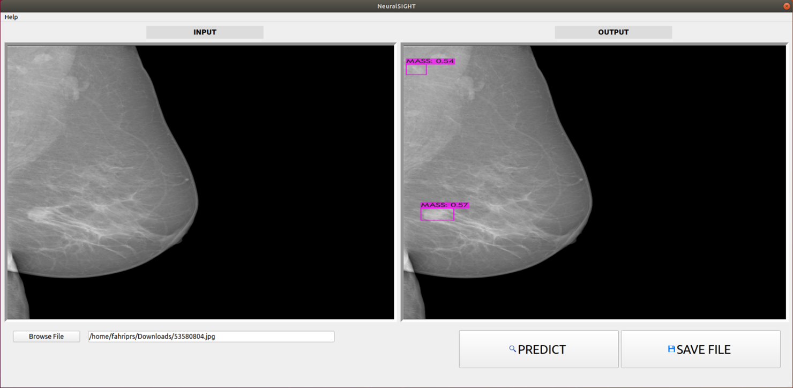

# Introduction


NeuralSIGHT is our final bachelor capstone project for detecting breast cancer mass using YOLO darknet and PyQt.

## Requirements
   - **PyQt5**
   - **YOLO darknet installed**
   - **OpenCV >= 4.4.0**

## How To Use

#### Step 0: Compile YOLO darknet 

Follow AlexeyAB's instruction of [How to compile YOLO darknet on Linux or Windows](https://github.com/AlexeyAB/darknet#how-to-compile-on-linuxmacos-using-cmake)

#### Step 1: Install PyQt5 and OpenCV

Simple installation from PyPI
```bash
pip install PyQt5
pip install opencv-python
```
From Conda
```bash
conda install -c anaconda pyqt
```

#### Step 2: Setup Folder

- Move `mainCV.py`,`main_windowCV.py`, and `splashscreen.py` to your darknet folder.
- Put your `your-weight.weights` to weights folder.

#### Step 3: Run Program

Run `mainCV.py` for OpenCV version inference 

## NeuralSIGHT Team
* [fahriwps](https://github.com/fahriwps)
* [mariojy10](https://github.com/mariojy10)
